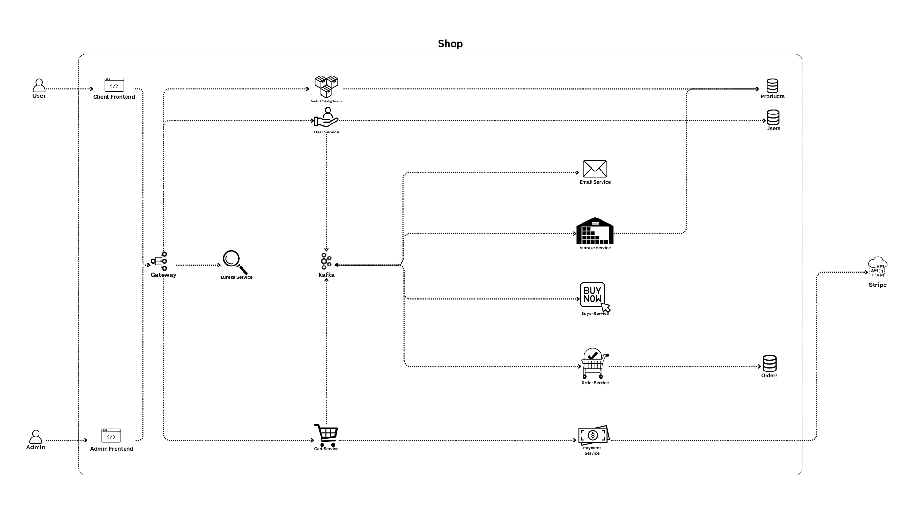

# Microstore

Das Ziel dieses Projekts ist es, die Architektur von Microservices für einen Online Shop zu entwerfen. Die Architektur soll die Services so aufteilen, dass sie eine klare Verantwortung haben und unabhängig voneinander sind. Da ein Online Shop sehr viele verschiedene Services benötigt, wird in diesem Projekt nur ein kleiner Teil eines Online Shops abgedeckt.

Microstore ist ein Online Shop, welcher Produkte anbietet, die der User in den Warenkorb legen und kaufen kann. Der User kann sich registrieren und anmelden. Der Admin kann Produkte hinzufügen, bearbeiten und löschen. Der Lagerbestand wird überwacht und die Bestellungen werden gespeichert.

## Microservices

### User Service

Der `User Service` handhabt die User. Er ist für Login, Registrierung und CRUD Operationen der User zuständig.

#### Registrierung

Bei der Registrierung sendet der `User Service` ein Event an den Kafka Broker, dass ein User registriert wurde. Der `Email Service` erhält das Event und sendet eine Email an den User. Sobald der User die Email bestätigt hat, wird sein Account aktiviert. Der `User Service` speichert den User in der Datenbank.

#### Login

Der `User Service` prüft die Anmeldedaten des Users und gibt ein Token zurück, wenn die Anmeldedaten korrekt sind. Das JWT Token wird für die Authentifizierung des Users benötigt.

#### Logout

Der `User Service` hat keine Funktion für das Logout. Der Client muss das Token löschen.

### Product Catalog Service

Der `Product Catalog Service` stellt dem Client Interface die zu verkaufenden Produkte zur Verfügung. Er ist für die CRUD Operationen der Produkte zuständig.

#### Read Operation

Der `Product Catalog Service` gibt die Produkte an den Client Interface zurück. Dafür ist keine Authentifizierung notwendig. Die Produkte werden in der Datenbank gespeichert und werden paginiert zurückgegeben.

#### Create / Update / Delete Operation

Die CUD Operationen sind nur für den Admin Interface zugänglich. Der Admin muss sich mit seinem Token authentifizieren, um die Produkte zu verwalten.

### Cart Service

Der `Cart Service` ist für die CRUD Operationen des Warenkorbs zuständig. Er validiert den Warenkorb und leitet den Checkout Prozess ein. Der Warenkorb selbst wird beim Client Interface gespeichert, sodass der User den Warenkorb auch nach einem Neuladen der Seite noch sehen kann.

#### CRUD Operationen

Der `Cart Service` handhabt die CRUD Operationen des Warenkorbs. Beim ändern des Warenkorbs wird er validiert und die Änderungen werden an den Client Interface zurückgegeben.

#### Checkout

Der Checkout Prozess wird eingeleitet, wenn der User den Warenkorb kaufen möchte. Zunächst überprüft der `Cart Service`, ob die Produkte noch auf Lager sind, indem er den `Storage Service` benachrichtigt. Wenn die Produkte auf Lager sind, wird der `Payment Service` kontaktiert und die Bezahlung wird eingeleitet. Nach erfolgreicher Bezahlung wird ein Event an den Kafka Broker gesendet, dass die Bestellung durchgeführt wurde.

### Payment Service

Der `Payment Service` ist lediglich für die Bezahlung zuständig.

#### Bezahlung

Der `Payment Service` ist mit einem externen Payment Service wie Stripe oder PayPal verbunden. Eingeleitet wird die Bezahlung durch den `Cart Service`.

### Email Service

Der `Email Service` ist für das Versenden von Emails zuständig. Er erhält Events vom Kafka Broker und sendet Emails an die User.

#### Email Bestätigung

Der `Email Service` sendet eine Email an den User, wenn dieser sich registriert hat. Der User muss die Email bestätigen, um seinen Account zu aktivieren. Den Inhalt der Email erhält der `Email Service` vom Kafka Broker.

#### Bestellbestätigung

Der `Email Service` sendet eine Email an den User, wenn dieser eine Bestellung durchgeführt hat. Der Inhalt der Email erhält der `Email Service` vom Kafka Broker.

#### Erweiterbarkeit

Theoretisch kann der `Email Service` für alle Emails verwendet werden, die an die User gesendet werden sollen. Da der `Email Service` Events vom Kafka Broker erhält, kann er von beliebigen Services verwendet werden.

### Order Service

Der `Order Service` ist für die Bestellungen zuständig. Er speichert die Bestellungen, führt eine Bestellung durch und gibt die versendet die Produkte an den User.

#### Bestellung

Der `Order Service` speichert die Bestellungen in der Datenbank. Intern können Mitarbeiter die Bestellungen einsehen und bearbeiten. Sobald eine Bestellung durchgeführt wurde, wird ein Event an den Kafka Broker gesendet, dass die Bestellung durchgeführt wurde.

### Storage Service

Der `Storage Service` ist für die Überwachung des Lagerbestands zuständig.

#### Überwachung

Wenn ein Produkt gekauft wird, wird der `Storage Service` benachrichtigt. Zunächst markiert der `Storage Service` das Produkt als verkauft. Zudem überprüft er, ob das Produkt noch auf Lager ist. Wenn das Produkt nicht mehr auf Lager ist, wird ein Event an den Kafka Broker gesendet, dass das Produkt nicht mehr auf Lager ist.

Wenn ein verkauftes Produkt versendet wird, wird der `Storage Service` benachrichtigt. Er markiert das Produkt als versendet und entfernt es aus dem Lagerbestand.

#### Schnittstelle

Der `Storage Service` hat eine Schnittstelle, die es anderen Services ermöglicht, den Lagerbestand abzufragen. Der `Cart Service` benutzt diese Schnittstelle beispielweise, um zu überprüfen, ob die Produkte noch auf Lager sind.

### Buyer Service

Der `Buyer Service` ist für das Kaufen von Produkten zuständig. Die Bestellung wird mittels Kafka erhalten und durchgeführt.

#### Bestellung

Der `Buyer Service` erhält die Bestellung durch den Kafka Broker. Er überprüft, ob die Produkte noch auf Lager sind und leitet den Checkout Prozess ein. Nach erfolgreicher Bezahlung wird die Bestellung durchgeführt.

### Eureka Service

Der `Eureka Service` ist für das Service Discovery zuständig. Er registriert die Services und leitet die Anfragen an die Services weiter.

### Kafka

Kafka ist ein Message Broker, der die Services asynchron miteinander kommunizieren lässt.

### Client Interface

Der `Client Frontend Service` ist für die Darstellung der Produkte und des Warenkorbs zuständig. Er zeigt die Produkte an, die in den Warenkorb gelegt werden können. Im Warenkorb kann der User die Produkte sehen, die er kaufen möchte. Beim Checkout wird der User aufgefordert, seine Daten einzugeben um zu bezahlen.

#### Authentifizierung

Der `Client Frontend Service` authentifiziert den User mittels JWT Token. Der Token wird beim Login vom `User Service` zurückgegeben und beim Logout gelöscht.

#### Warenkorb

Der `Client Frontend Service` speichert den Warenkorb im Local Storage des Browsers. Der Warenkorb wird beim `Cart Service` gespeichert und kann vom User eingesehen werden.

### Gateway

Das `Gateway` dirigiert die Anfragen an die Services.

#### Sinn

Das `Gateway` kappt die Verbindung zwischen den Services und dem Client Interface. Es leitet die Anfragen an die Services weiter und gibt die Antworten an den Client Interface zurück. Somit sind die Services nicht direkt vom Client Interface sicht- sowie erreichbar.

### Admin Interface

Der `Admin Interface` ist für das Management der Produkte zuständig. Er kann neue Produkte hinzufügen, bestehende Produkte bearbeiten und löschen. Der Admin kann die Bestellungen einsehen und die Bestände überwachen.

#### Lagerbestand

Das `Admin Interface` kann den Lagerbestand mittels des `Storage Service` überwachen. Es kann sehen, welche Produkte auf Lager sind und welche nicht.

#### Bestellungen

Das `Admin Interface` kann die Bestellungen einsehen. So kann es sehen, welche Produkte bestellt wurden und welche noch versendet werden müssen.

## Fehlerbehandlung

Bei der Fehlerbehandlung gibt es verschiedene Aspekte, die beachtet werden müssen. Wir haben uns folgendes überlegt:

### Logging und Monitoring

Das Monitoring kann beispielsweise mit Prometheus und Grafana realisiert werden. So können wir die Performance und Gesundheit der einzelnen Services ansehen und somit Fehler erkennen. Zusätzlich könnten wir auch den `Email Service` benutzen, um uns bei gravierenden Fehlern oder Gefahren zu benachrichtigen.

### Hystrix als Resilience Library

Die Services sollten mit `Hystrix` ausgestattet werden, sodass sie temporäre Fehler abfangen können und die Aktionen erneut ausführen können. Zudem kann `Hystrix` auch als Circuit Breaker verwendet werden, um fehlerhafte Aktionen zu unterbrechen und Fallbacks bereitzustellen.

## Erweiterbarkeit

Die Architektur ist zum jetzigen Zeitpunkt noch relativ simpel. Um einen Vollständigen Shop zu erstellen, müssten noch viele weitere Services hinzugefügt werden.

### Internes Interface

Damit die Mitarbeiter im Lager die Bestellungen einsehen und abarbeiten können, müsste ein internes Interface erstellt werden. Dieses Interface würde die Bestellungen anzeigen und die Mitarbeiter könnten die Bestellungen als versendet markieren. Zudem könnten sie den Lagerbestand einsehen und bearbeiten, wenn eine Lieferung eintrifft.

### Buyer Datenbank

Dass der `Storage Service` weiss, welche Produkte bereits nachbestellt wurden, müsste eine Buyer Datenbank erstellt werden. Diese würde die Bestellungen speichern und der `Storage Service` könnte sehen, welche Produkte bereits nachbestellt wurden.

